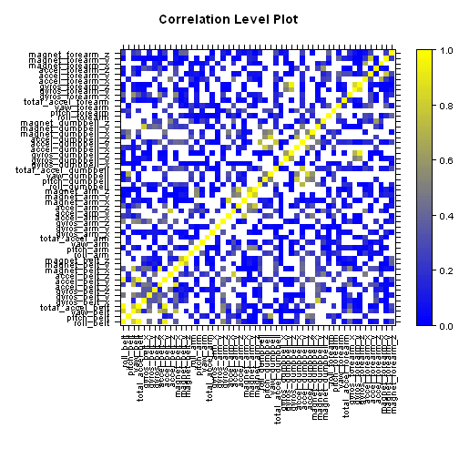

Practical Machine Learning - Prediction Assignment Writeup
========================================================

## Background 

Using devices such as Jawbone Up, Nike FuelBand, and Fitbit it is now possible to collect a large amount of data about personal activity relatively inexpensively. These type of devices are part of the quantified self movement – a group of enthusiasts who take measurements about themselves regularly to improve their health, to find patterns in their behavior, or because they are tech geeks. One thing that people regularly do is quantify how much of a particular activity they do, but they rarely quantify how well they do it. In this project, your goal will be to use data from accelerometers on the belt, forearm, arm, and dumbell of 6 participants.


## Getting started

A key early component of any machine learning project involves managing and understanding the data.

## Loading data

The data come CSV (comma separated values) format and they can be easily loaded by using R functions:


```r
data <- read.csv("pml-training.csv",  na.strings = "NA", stringsAsFactors = FALSE)
unlabeled <- read.csv("pml-testing.csv",  na.strings = "NA",  stringsAsFactors = FALSE)
```

The training set consists of 19622 observations of 160 variables (features), witch data$classe is the dependent variable.


```r
dim(data)
```

```
## [1] 19622   160
```

Looking up the dataset we can see that many of the 159 features are empty in most of the observations:


```r
sum(complete.cases(data))
```

```
## [1] 406
```


## Exploring data

I choose 52 features and discanding some features that only introduced noise and can cause overfitting such as X, user_name, raw_timestamp_part1, raw_timestamp_part2, cvtd_timestamp, new_window and num_window.


```r
columns <- c("roll_belt", "pitch_belt", "yaw_belt", "total_accel_belt", "gyros_belt_x", 
    "gyros_belt_y", "gyros_belt_z", "accel_belt_x", "accel_belt_y", "accel_belt_z", "magnet_belt_x",
    "magnet_belt_y", "magnet_belt_z", "roll_arm", "pitch_arm", "yaw_arm", "total_accel_arm",
    "gyros_arm_x", "gyros_arm_y", "gyros_arm_z", "accel_arm_x", "accel_arm_y", "accel_arm_z",
    "magnet_arm_x", "magnet_arm_y", "magnet_arm_z", "roll_dumbbell", "pitch_dumbbell", 
    "yaw_dumbbell", "total_accel_dumbbell", "gyros_dumbbell_x", "gyros_dumbbell_y", 
    "gyros_dumbbell_z", "accel_dumbbell_x", "accel_dumbbell_y", "accel_dumbbell_z", 
    "magnet_dumbbell_x", "magnet_dumbbell_y", "magnet_dumbbell_z", "roll_forearm", 
    "pitch_forearm", "yaw_forearm", "total_accel_forearm", "gyros_forearm_x", "gyros_forearm_y",
    "gyros_forearm_z", "accel_forearm_x", "accel_forearm_y", "accel_forearm_z", "magnet_forearm_x",
    "magnet_forearm_y", "magnet_forearm_z")

training <- data [, columns]
```

With this transformation, the resulting  dataser is now of 19622 observations of 53 features.


```r
dim(training)
```

```
## [1] 19622    52
```

```r
sum(complete.cases(training))
```

```
## [1] 19622
```

Now, once cleaned the dataset try to analyze the correlation between features.


```r
correlation <- cor(training)
library(lattice)
palette <- colorRampPalette(c("blue", "yellow"), space = "rgb")
levelplot(correlation, 
          main="Correlation Level Plot", xlab="",ylab="",aspect=1,
          col.regions=palette(120), pretty=TRUE,
          cuts=100, at=seq(0,1,0.01),
          scales=list(x=list(rot=90)) )
```

 

Most of features have no too many degree of correlation. However, some other features that are correlated. I going to reduce the number of features, removing the correlated ones.


```r
library("caret")
```

```
## Loading required package: ggplot2
```

```r
highCorr <- findCorrelation( correlation, 0.90)

columns <- columns [-highCorr]

training <- data [, c(columns,"classe")]

dim(training)
```

```
## [1] 19622    46
```


## Getting a Predictive Model

I train a classifier by using the GBM tool (Stochastic Gradient Boosting). I do not use cross validation and run for 100 iterations with a step size of 0.1.


```r
set.seed(1)

library(caret)
library(gbm)
```

```
## Loading required package: survival
## Loading required package: splines
## 
## Attaching package: 'survival'
## 
## The following object is masked from 'package:caret':
## 
##     cluster
## 
## Loading required package: parallel
## Loaded gbm 2.1
```

```r
inTrain <- createDataPartition(training$classe, p = 0.6, list = FALSE)
myTraining <- training [inTrain,]
myTesting <- training[-inTrain,]


control <- trainControl(method = "none")
tune <- expand.grid(.interaction.depth = 4, .n.trees = 100, .shrinkage = 0.1)

model <- train ( classe ~ ., data=myTraining , method="gbm" , tuneGrid=tune, trControl = control, verbose=FALSE)
```

```
## Loading required package: plyr
```

```r
model
```

```
## Stochastic Gradient Boosting 
## 
## 11776 samples
##    45 predictors
## 
## No pre-processing
## Resampling: None
```


## Validating the model

Let's see how well performs the model against the testing dataset. Then, I calcule the confunsion matrix by using the prediction on the testing data. The confusion matrix indicate that the model fit well the training set. The accurancy is near 0.96.


```r
prediction <- predict (model, newdata = myTesting[, columns] )

confMatrix <- confusionMatrix ( prediction , myTesting$classe)

confMatrix
```

```
## Confusion Matrix and Statistics
## 
##           Reference
## Prediction    A    B    C    D    E
##          A 2189   55    0    1    4
##          B   24 1393   52    4   25
##          C   11   58 1287   52    5
##          D    6    7   25 1218   18
##          E    2    5    4   11 1390
## 
## Overall Statistics
##                                         
##                Accuracy : 0.953         
##                  95% CI : (0.948, 0.958)
##     No Information Rate : 0.284         
##     P-Value [Acc > NIR] : < 2e-16       
##                                         
##                   Kappa : 0.941         
##  Mcnemar's Test P-Value : 6.98e-08      
## 
## Statistics by Class:
## 
##                      Class: A Class: B Class: C Class: D Class: E
## Sensitivity             0.981    0.918    0.941    0.947    0.964
## Specificity             0.989    0.983    0.981    0.991    0.997
## Pos Pred Value          0.973    0.930    0.911    0.956    0.984
## Neg Pred Value          0.992    0.980    0.987    0.990    0.992
## Prevalence              0.284    0.193    0.174    0.164    0.184
## Detection Rate          0.279    0.178    0.164    0.155    0.177
## Detection Prevalence    0.287    0.191    0.180    0.162    0.180
## Balanced Accuracy       0.985    0.951    0.961    0.969    0.980
```


## Generating the answers

I use the obtained model to predict labels for the unlabeled dataset.


```r
answers <- predict (model, newdata = unlabeled[, columns] )

answers
```

```
##  [1] B A B A A C D D A A B C B A E E A B B B
## Levels: A B C D E
```
